# The Old Dog Bookshop

The Old Dog Bookshop website is designed to give potential customers informative about the shop. This means the site needs to be responsive, allowing visiters to view on any device without quality of experience suffering. The main focus of the site is to give viewers information such as location of the shop, and contact details.

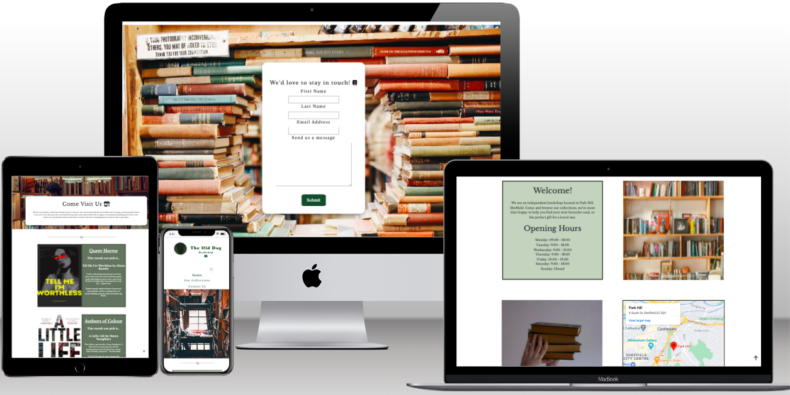

[Link to my website](https://skyeh-m.github.io/The-Old-Dog/)

## Contents

* [User Experience (UX)](#user-experience-ux)
  * [Project Goals](#project-goals)
  * [Developer and Business Goals](#developer-and-business-goals)
  * [User Stories](#user-stories)

* [Design](#design)
  * [Colour Scheme](#colour-scheme)
  * [Typography](#typography)
  * [Icons and Images](#icons-and-images)
  * [Features](#features)
  * [Accessibility](#accessibility)
  * [Wireframes](#wireframes)

* [Technologies Used](#technologies-used)
  * [Languages Used](#languages-used)
  * [Frameworks, Libraries & Programs Used](#frameworks-libraries-and-programs-used)

* [Deployment](#deployment)
  * [Local Deployment](#local-deployment)

* [Testing](#testing)
  * [Automated Testing](#automated-testing)
    * [W3 Nu HTML Validator](#w3-nu-html-validator)
    * [W3C CSS Validation Service](#w3c-css-validation-service)
    * [Wave](#wave-testing)
    * [Lighthouse](#lighthouse-testing)

  * [Manual Testing](#manual-testing)
  * [Bugs](#bugs)

* [Credits](#credits)
  * [Code Sections](#code-sections)
  * [Media](#media)
  * [Text](#text)
  * [Acknowledgements](#acknowledgements)

## User Experience (UX)

### Project Goals
The main goal of The Old Dog website is to advertise the bookshop and give potential customers crucial information that they'd need to shop with us. For example, 

* The site will contain an interactive Google map section on the homepage to enable viewers to locate the shop and plan their journey to visit us.
* The site will also include a written address for customers that would prefer to use a satnav or alternative means of planning their journey. 
* The site will describe the range of items we sell including inspiration for viewers future reads through the Our Collections page. This aims to encourage viewers to visit the shop to purchase books they're interested in, and encourages repeat visiters as the Our Collections page will change every month.
* There will be a contact page which will list the contact details for The Old Dog so that customers can quickly and easily ask any questions they have.
* The design, and navigation of the site will be simple and clear so that information is readily available to enable viewers to answer any questions they may have when visiting the site.

### Developer and Business Goals
* A main developer goal is to make the site as accessible as possible for any customer to use, no matter their needs and abilities. This will be principally achieved by the use of clear design, and alt text for screen readers.
* A focal business goal for the site would be to encourage repeat viewings in the hope that this encourages viewers to visit the shop and make purchases. This will be achieved by having an aesthetically pleasing and easy to navigate site, along with the Our Collections page frequently updating with new book recommendations.

### User Stories
As someone using The Old Dog website I want:
 1. To be able to quickly and easily navigate the site 
 2. To be able to successfully find any information I'm looking for
 3. To get a feel for the aesthetic and style of the bookshop to know whether items are clearly laid out and accessible, and that there is a large, varied selection of books on offer
 4. When I submit a question using the contact form I want confirmation that this query has been received by the bookshop, and be provided with an estimate of when I'll receive a response
 5. To be inspired to purchase and read books outside of my typical genres of choice, or have my attention drawn to books that I know I'll enjoy but haven't yet heard of
 6. I want to be able to visit The Old Dog website on any device I own whether the quality of the site, or the information available suffering

 ## Design 
 ### Colour Scheme

 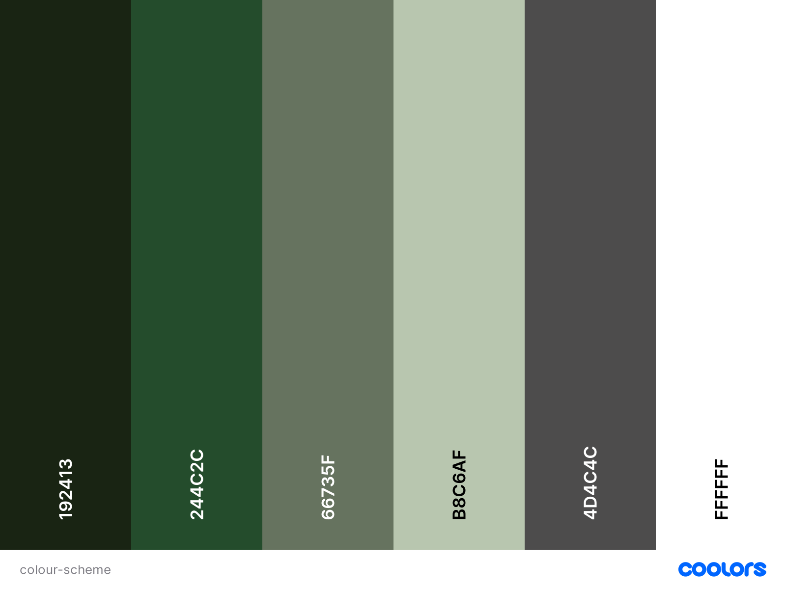

 The primary colour is a dark shade of forest green which speaks to the rustic and well-established nature of the bookshop, it communicates that the shop is reliable. The green colour scheme is evocative of the theme of books in general as it is reminiscent of trees and greenery.

 The lighter shades of green used on the site add an element of visual difference to keep viewers engaged, while also complimenting the focal dark green.

 The dark green used in the logo, title, and footer are the same shade to ensure consistency of style.

 ### Typography
I used [Google Fonts](https://fonts.google.com/) to import the following fonts to the site

 
 * The primary font used for headings and the navigation menu is Libre Baskerville, this was chosen as it's easily readible and promotes the idea that this bookshop is well-established, and 
 dependable.
 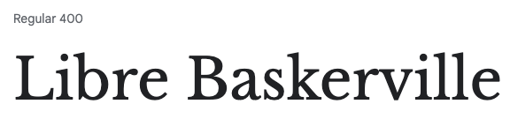
 * The secondary font used for the body is Libre Caslon Text which was selected for its clear readibility, and design that is reminiscient of fonts used in the text of many books
 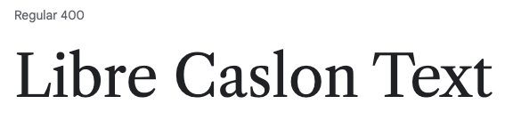
 * Both fonts are from the Serif family to ensure consistency throughout the site

 ### Icons and Images

 * Icons were sourced from [FontAwesome](https://fontawesome.com/), they were selected to be easily understandable and contextually relevant. For example, the Contact Us section has an icon of a phone alongside the header text. Icons are used occasionally to elevate the design of the page to break up chunks of text so the site doesn't lose the engagement of the viewer.  
 * All icons on the site have been titled so that screen readers can provide a description of their appearance for users with different needs.

 * No images used belong to myself and they will all be individually credited in a later section.
 * Images were chosen to give viewers an idea of what the bookshop looks like if they haven't visited the shop in person. The images are warm in tone to convey a friendly and helpful environment where potential customers feel comfortable visiting.
 * Images used in the Contact Us page are positioned in the background with text laid over the top displayed against a white background so viewers aren't distracted by images.

 ### Features
 The Old Dog website includes three main pages, Home, Our Collections, and Contact Us, these pages are all accessible through the navigation menu shown near the top of the screen. A Thank You page is also accessible if a viewer submits a question to the Contact Us page to notify them that their question has been received. On the index page there is working Youtube content which is copright free from the channel Creative Commons. This video does not autoplay, it only plays when a user actively clicks on the content.

 * The pages include:
   * A navigation bar that enables viewers to navigate to each of the three main pages of the site. The page the viewer is currently on is displayed with an underlined title to show which page is active. Upon hovering over each of the navigation links they'll also be underlined to show the viewer where they are clicking. The navigation bar is responsive meaning that it decreases in size if viewed on smaller screen sizes, and becomes a collapsible hamburger bar if viewed on mobile. This is to streamline the appearance of the navigation bar and reduce clutter on mobile screens.
   * A footer is displayed at the bottom of each page which displays social media links to Facebook, Instagram, and Twitter for viewers to get in contact with us on multiple platforms. 
   * The browser tab includes a [Favicon](https://favicon.io/) of an open book to make the tab stand out among others allowing viewers to revisit our site easily

* Future Implementations
  * In the future a main goal is to allow viewers to purchase books online from the website, and have them delivered to their houses rather than simply encouraging viewers to visit the physical bookshop. The hope is that this would greatly expand the sales of The Old Dog bookshop as it'd allow people not from Sheffield to become frequent customers.

### Accessibility

Accessibility has been in the forefront of my mind throughout the design and construction of The Old Dog website.
* I tested all pages of my site using [WAVE](https://wave.webaim.org/) and have no errors on any page.
* Lighthouse testing for desktop and mobile have scored 100% for accessibility on both

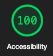
* I used semantic HTML throughout, and have provided aria-labels, alt text on images, and titles wherever possible to enable the best experience possible for viewers using screen readers or alternative technology.
* I used [A11y](https://color.a11y.com/) the Color Contrast Accessibility Validator which determined that no colour contrast issues were found on my site

### Wireframes

Before beginning work constructing my site I briefly sketched a basic idea of what my page might look like. This differs considerably to my later wireframes and actual site but still keeps core concepts the same. 

* [Original Sketch](./docs/early-design.png)

I later created wireframes of mobile, tablet, and desktop appearances of each of my three main pages, this solidified my design choices.

* [Home page wireframe](./docs/home-wireframe.png)
* [Our Collections wireframe](./docs/collections-wireframes.png)
* [Contact Us wireframe](./docs/contact-wireframes.png)

## Technologies Used

### Languages Used
* HTML, and CSS were used to complete this project

### Frameworks, Libraries, and Programs Used
* Adobe XD was used to create Wireframes
* [Birme](https://www.birme.net/) was used to reformat images to a webp
* Bootstrap Version 4.0 was used to create a responsive Navbar and collapsable hamburger menu for mobile
* [Favicon](https://favicon.io/) was used to create a browser tab icon
* [Font Awesome](https://fontawesome.com/) was used for all icons on the pages
* Github was used to store all files for this website
* Gitpod was used to create and edit all original code
* Google Chrome Developer Tools was used for debugging and testing with Lighthouse
* [Google Fonts](https://fonts.google.com/) was used to import both fonts for use on the site
* [Tech Sini](https://techsini.com/multi-mockup/index.php) was used to create a multi device website mockup to demonstrate responsivity
* [Tiny Png](https://tinypng.com/) was used to resize image files to help the browser load pages quicker
* [Web Formatter](https://webformatter.com/) was used to properly format all of my code throughout the project to ensure easy reading and compliance to industry standards

## Deployment

The Old Dog website is deployed using Github Pages, this was done by:

1. Login to Github
2. Navigate to the account SkyeH-M, and locate the The-Old-Dog repository
3. In The-Old-Dog repository click on the Settings tab
4. In the Code and Automation subheading in the sidebar click on Pages
5. Under Build and Deployment find the Source section, set the source to deploy from a branch, and set this branch to main, and the folder option to /root 
6. Click save, wait a few minutes and The Old Dog site is now deployed at the URL displayed

## Local Deployment
### How to Clone 

1. Locate the main page of The-Old-Dog repository, click the Code button to the left of the green Gitpod button
2. Copy the URL of the repository, you can click on headings for HTTPS, SSH, and Github CLI to find their individual links
3. Open your own terminal in your editor and change the current working directory to the location of where you want the cloned directory to be
4. In the terminal type git clone, and then paste the URL you copied from The-Old-Dog repository page
5. Press enter to complete

### How to Fork

1. Locate the main page of The-Old-Dog repository
2. Click the fork button in the top right of the screen, between the watch, and star buttons

### How to port files from Atom to Gitpod/Github

Below I have listed the steps I took to port my files over from Atom, which I began creating my project in, to Github so that I could work on it using Gitpod:

1. I located my files that were saved locally in a folder in my computer documents
2. I created a new repository on Github for my project by clicking the Create a new repository button on the Github dashboard
3. I opened my repository
4. I highlighted all relevant files in my documents and dragged them into the workspace for my new repository

I would like to note that this isn't the most efficient or industry standard method of completing this task, however it was what was available to me at the time. 

## Testing

## Automated Testing
### W3 Nu HTML Validator

The Nu HTML Checker was used on each page of The Old Dog site at multiple stages throughout development, below are the final assessments showing no issues or warnings:

* [Home page score](./docs/html-index.png)
* [Our Collections page score](./docs/html-collections.png)
* [Contact Us page score](./docs/html-contact.png)
* [Thank You page score](./docs/html-thank-you.png)

### W3C CSS Validation Service

The W3C CSS Validation Service has also been used throughout the creation of this site, below is the final assessment showing no errors:

* [CSS Validator score through direct input](./docs/css-validator.png)
* [Here](./docs/css-warnings.png) shows the CSS validator warnings which only state that imported style sheets cannot be checked in direct input

### Wave Testing

Each page was run through the Web Accessibility Evaluation Tool (Wave) multiple times throughout development, I addressed any errors that were present and now have the following scores:

* [Home page](./docs/wave-index.png)
* [Our Collections page](./docs/wave-collections.png)
* [Contact Us page](./docs/wave-contact.png)
* [Thank You page](./docs/wave-thank-you.png)

The alerts present on each page are related to having a redundant link in the top of the page as the title text, and Home button in the navbar both link back to the home page. I decided to keep this 'redundant' link as I wanted to give viewers the option of clicking the title to return to the home page. The other alert warns against using underlined text, but I still felt it important to use underlining as a tool to show viewers which page they're currently on, and which they're hovering over.

However, I would welcome any feedback about the features that have triggered alerts, and am open to removing them in the future if they prove to be inaccessible for some viewers. 

### Lighthouse Testing

## Desktop

* [Home page](./docs/d-lighthouse-index.png)
* [Our Collections page](./docs/d-lighthouse-collections.png)
* [Contact Us page](./docs/d-lighthouse-contact.png)
* [Thank You page](./docs/d-lighthouse-thank-you.png)

Above are the Lighthouse testing results for desktop, my accessibility and SEO results are 100 which I am pleased with as I made these a priority throughout development

My best practises scores on each page suffer at a score of 83 due to known security vulnerabilities within the Bootstrap libraries I've used. These security concerns are outside of my control and so I cannot improve this warning any further. I have a warning for user experience due to images being displayed with incorrect aspect ratio, the ratio of these are off by 5% at most. I made an aesthetic choice to size and display images as they have been and don't think this imapcts the image quality so I have chosen to leave these as they are. If I encountered any issues or critical feedback as a result of the incorrect image ratio I would fix this issue.

## Mobile

* [Home page](./docs/m-lighthouse-index.png)
* [Our Collections page](./docs/m-lighthouse-collections.png)
* [Contact Us page](./docs/m-lighthouse-contact.png)
* [Thank You page](./docs/m-lighthouse-thank-you.png)

Above are the Lighthouse testing scores for mobile performance, again my Accessibility and SEO scored 100. 

My performance score for mobile is around 87 with the following main warning being that the site doesn't use passive listeners to improve scrolling performance. As the solution to this would include writing JavaScript I have deemed this to be a problem that can be fixed in the future as I don't believe it negatively impacts user experience significantly. My best practises score for mobile is also affected by JavaScript libraries having known security issues, which as stated above is out of my control as this time. My performance score for the index.html page on mobile has a diagnostics warning of "serve static assets with an efficient cache policy". After reading around this issue on Google and Slack I do not believe this to be something that I can currently rectify so will attempt to fix this in the future.

## Improvements Made

In order to improve my Lighthouse scores I implemented multiple changes;

* I first converted all image files to webp format to aid loading times and scores
* I also made sure any script files were placed at the end of the body in HTML rather than the head so that the most important content was loaded first so improve user experience

## Manual Testing

### Testing User Stories

| Aims            | Are the aims being met? | Images |
|-----------------|-------------------|-----------------|
| 1. To be able to quickly and easily navigate the site | Navbar is prominantely displayed at the top of screen and links are labelled clearly, hamburger menu is familiar to viewers so they'll understand its function | 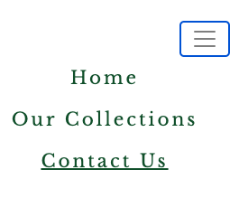 |
| 2. Be able to successfully find any information | Pages and menu links are clearly written and information is available on each page with large headings to draw attention to important sections |  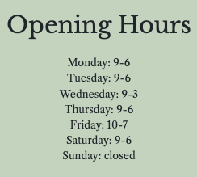|
| 3. To get an aesthetic and practical feel of the bookshop | Images show multiple aspects of the shop to viewers get get a feel for the shop, encouraging them to visit in person |  |
| 4. Get an acknowledgement that my query has been received| User is directed to a thank you page that acknowledges their query has been received, showing contact information and a time estimate for a response | 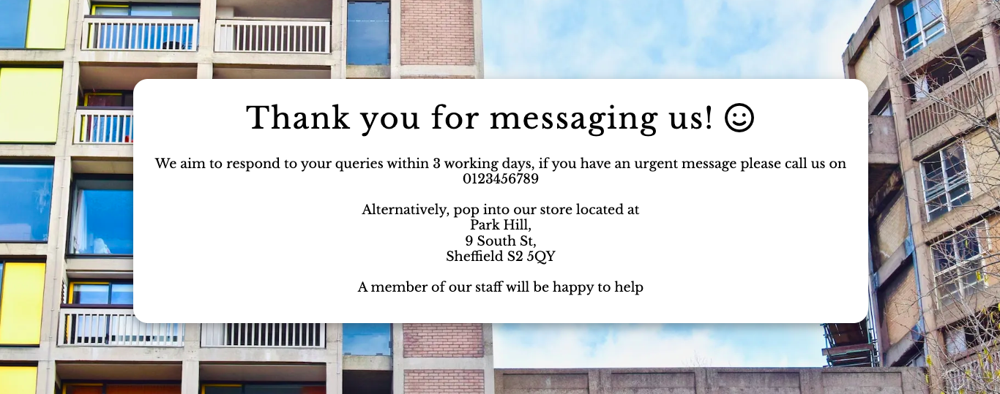|
| 5. Be inspired to read or purchase new books | Our Collections page will change monthly (or more frequently) to highlight great reads and intrigue viewers into purchasing them through the shop. This also encourages repeat visitors | 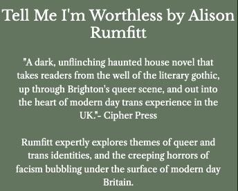|
| 6. Be able to visit the site on any device | The page has been designed responsively (including using a hamburger navbar) to ensure the site is accessible on any device. Content changes to displaying 3 items on one line in desktop, to displaying one per line on mobile | 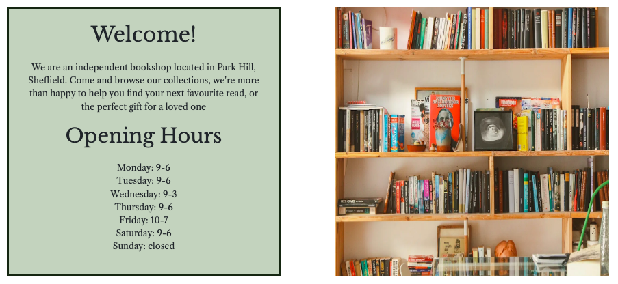 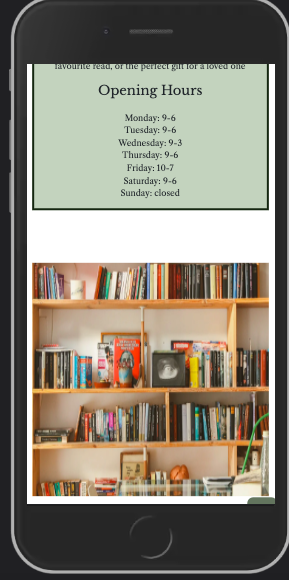|

### Full Testing 

All pages have been extensively manually tested throughout the development of this project, the results of which are below:

* Home page:
  * All links direct to the correct pages in a timely manner and social media links open in a new browser to ensure viewers return to our site. The Home link in the navbar is underlined when on the Home page, and each other link is underlined when hovered over. The map is interactive and can be opened in a new browser for users to plan their individual journey to the book shop. All elements move responsively when the size of the browser viewport is changed. 
* Our Collections page:
  * All links direct to the correct pages in a timely manner and social media links open in a new browser to ensure viewers return to our site. The Our Collections link in the navbar is underlined when on the Our Collections page, and each other link is underlined when hovered over. All elements move responsively when the size of the browser viewport is changed
* Contact Us page:
  * All links direct to the correct pages in a timely manner and social media links open in a new browser to ensure viewers return to our site. The Contact Us link in the navbar is underlined when on the Contact Us page, and each other link is underlined when hovered over. All elements move responsively when the size of the browser viewport is changed. The contact form can only be submitted if a user enters their first name, last name, email address, and a message. The email address must also be valid for a submission to be made otherwise the site will prompt the user to enter a valid address. 

  This site was developed using Chrome and tested on other internet browsers:
  * Firefox version 108.0 (64-bit) [Firefox Image1](./docs/firefox-name.png) - I tested this site using Firefox and everything I listed in the Full Testing section above remains true. All navigation links still work, images all display as desired, the fonts I selected are still displayed, the social media links open in a new browser, and the scroll to top button works. The responsivity of the site remains the same as when using Chrome, and to the same specification as I had designed. The contact us form works perfectly too, not allowing a user to click the submit button without filling in the relevant text areas, and with a valid email address. 
  * Safari version 15.4 [Safari Image](./docs/safari-opening-hours.png) [Safari Image 2](./docs/safari-email.png) - I tested this site using Safari and everything I listed in the Full Testing section above remains true. All navigation links still work, images all display as desired, the fonts I selected are still displayed, the social media links open in a new browser, and the scroll to top button works. The responsivity of the site remains the same as when using Chrome, and to the same specification as I had designed. The contact us form works perfectly too, not allowing a user to click the submit button without filling in the relevant text areas, and with a valid email address.

## Bugs

| Bugs            | Have they been solved? | How? |
|-----------------|-------------------|-------------------|
| 1. My first bug concerned images not displaying on my site | Yes | This was solved by altered the file paths directing to these and ensuring I use relative, not absolute file paths |
| 2. I ran into bugs while trying to format the layout of my index.html page, images of this issue can be found [here](./docs/bug2.png) | Yes | The main issue was caused by my setting the position of my elements to absolute meaning that they'd not respond as desired to CSS and Flex commands. This also caused an issue for responsivity as when the browser viewport decreased in size the elements would overlap and become unreadable. I removed the absolute positioning and grouped elements into rows so I could easily position them using Flexbox |
| 3. Multiple bugs occured when trying to format the navbar for mobile screens, with the aid of my mentor I was able to position the hamburger to the left on the same row as the logo and title. This however caused the following issues [image1](./docs/bug3-lg-screen.png) [image2](./docs/bug3-sm-screen.png)| Partially | I was unfortunately unable to resolve these bugs so opted to return the hamburger placement to being underneath the logo and title as this is easily readable and navigatable by users. This is however something I intend to change in the future to improve UI and the design of the site |

In the future I would also like to refactor a lot of my code, specifically the CSS file as it could definitely be cut down. Unfortunately I ran out of time to properly devote my attention to this but it is something I'd like to work on.

## Credits
### Code Sections

* Code sections were used from multiple Code Institute Projects as a basis for my project, most notably the [social media links from Love Running](https://learn.codeinstitute.net/courses/course-v1:CodeInstitute+CSE101+2020_Q2/courseware/be0e510a3aca4bccb6e0bba4cf7cf06b/15fe9d557bcc4af5a117465b9150454f/). Alongside the foundation of a basic form being used as it was done in the Love Running project
* [Navbar from Bootstrap Version 4.0](https://getbootstrap.com/docs/4.0/components/navbar/) was used to make a collapsible hamburger navbar for mobile, and was altered to fit my specific needs
* The development on my scroll to top button was aided considerably by Code Institute tutor Ed Bradley
* [Horizontal rule with an icon in the center](https://codepen.io/johngerome/pen/jyrOrq)
* [Submit button hover effect](https://github.com/IanLunn/Hover#licenses)
* [Box shadow effect](https://getcssscan.com/css-box-shadow-examples)

### Media 

The following sites were used to source high quality images

* [Unsplash](https://unsplash.com/)
* [Pexels](https://www.pexels.com/)

1. The logo and title text for The Old Dog was designed, with my specification and style choices in mind, by my partner Isabelle Harley using [Procreate](https://procreate.com/)
2. [Main image on the home page by Clay Banks](https://unsplash.com/photos/z_DkoUqgx6M)
3. [Bookshelf image by Tiana](https://www.pexels.com/photo/books-in-shelf-inside-room-2898170/)
4. [Person holding books image by Alexandra Krainyukhova](https://www.pexels.com/photo/a-person-holding-books-8207315/)
5. [Store open as normal image by Tetiana Shyshkina](https://unsplash.com/photos/9PTI7sz3z48)
6. [Youtube video Kelsey Merkley, "Horizontal Hostility" on Creative Commons](https://www.youtube.com/watch?v=1Y0FuH5FNCo)
7. [Main Collections page image by Hatice Yardim](https://unsplash.com/photos/lOdjS_r3deI)
8. [Tell Me I'm Worthless book cover published by Cipher Press](https://www.cipherpress.co.uk/tellmeimworthless)
9. [A Little Life book cover published by Knopf DoubleDay Publishing Group](https://www.penguinrandomhouse.com/books/239717/a-little-life-by-hanya-yanagihara/)
10. [Fearing The Black Body book cover published by NYU Press](https://nyupress.org/9781479886753/fearing-the-black-body/)
11. [Contact form background image by Fallon Michael](https://unsplash.com/photos/qmlGWIaIgpo)
12. [Contact information background image by Pixabay](https://www.pexels.com/photo/bookcase-books-bookshop-bookstore-220326/)
13. [Thank You page main background image by Benjamin Elliott](https://unsplash.com/photos/O5_RiTqiHGs)

### Text

* All text was written by myself, aside from that displayed within quotation marks on the site. The credit for which is listed below:
  * [Tell Me I'm Worthless blurb](https://www.cipherpress.co.uk/tellmeimworthless)
  * [A Little Life review 1](https://www.waterstones.com/book/a-little-life/hanya-yanagihara/9781529077216)
  * [A Little Life review 2](https://www.independent.co.uk/)
  * [Fearing The Black Body review- Fat Studies Journal](https://www.tandfonline.com/doi/full/10.1080/21604851.2020.1747721)

## Acknowledgements

* My mentor Akshat Garg was instrumental in the refinement and functioning of my site, allowing me to fix key issues and assuring I met the project deadline
* My South Staffordshire College mentor Robert Mclaughlin was key in helping me throughout this project with any questions, issues, or concerns I had

